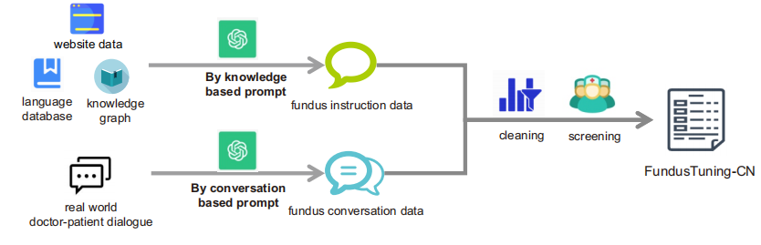
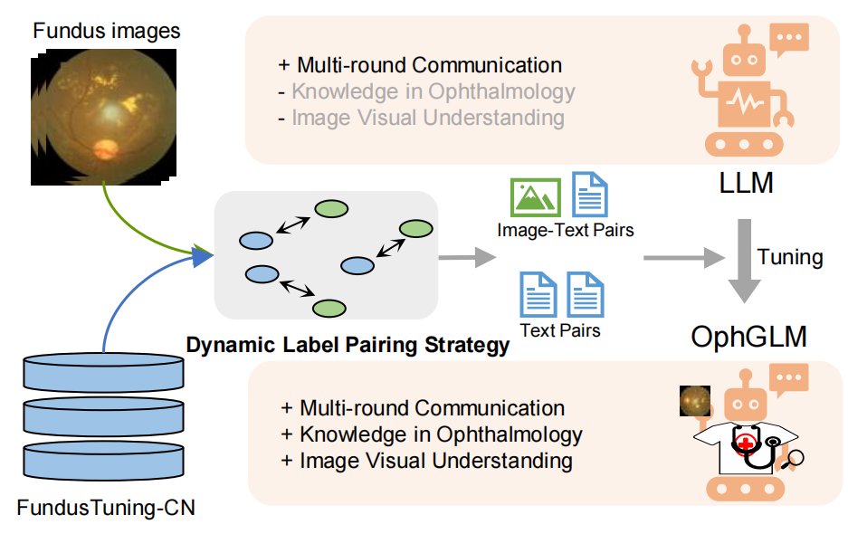

# OphGLM

The first ophthalmology Large Language-and-Vision Assistant based on Instructions and Dialogue

Table of content

- [Motivation](#motivation)
- [Modules](#modules)
- [Dataset](#dataset)
- [Building Process](#process)
- [News](#news)
- [Reference](#reference)

## Motivation

**OphGLM aims to enhance ophthalmic diagnostics by integrating visual and language models, improving human-computer interaction and clinical applicability. With the introduction of the FundusTuning-CN dataset, we hope to demonstrate promising advancements in fundus disease classification and interactive capabilities, paving the way for future developments in this field.**

## Modules

Constructing a fine-tuning dataset suitable for large language models in specific diseases from both basic knowledge and dialogue perspectives:

The illustration of Dynamic Label Pairing Strategy:

Basic LLM Model and Pre-trained Model:

[ChatGLM-6B](https://github.com/THUDM/ChatGLM-6B)

## Dataset

We have provided some available data in this source code, including:
Ophthalmology historical doctor-patient dialogue from year 2010 to 2020
&
Fine-tunning data sample in JSON

For building a fine-tuning dataset for LLMs targeting specific diseases, we recommend data collection from two aspects: foundational background knowledge and doctor-patient dialogues, from a clinical application perspective. The potential difficulty here lies in the fact that for specific diseases, especially rare diseases, doctor-patient dialogue data is very scarce.

## Process

Step1: Constructing the Classification Model
Leverage the ODIR5K Fundus Image Dataset
- Selected images for Diabetic Retinopathy (DR), Age-related Macular Degeneration (AMD), Glaucoma, Myopia, and Cataracts from the ODIR5K dataset.
Employing ConvNext as Image Encoder
- Used ConvNext for image encoding, pretraining on a multi-disease classification task.

Link:
[ODIR5K](https://www.kaggle.com/datasets/tanjemahamed/odir5k-classification)

Step2: Collecting and Building LLM Fine-tunning Datasets

Fundus Instruction Set
- Gathered information from web data and knowledge graphs, categorized into five subsets:
  - Visual Diagnostic Instructions
  - Causes and Symptoms
  - Diagnosis and Examination
  - Treatment and Prevention
  - Prognosis and Lifestyle
Fundus Conversation Set
- Assembled fundus-related conversations, covering both rich and limited ophthalmic knowledge.

Step3: OphGLM Architecture

Components
- Includes an Image Encoder, Text Encoder, Fusion Module, and a Large Language Model (LLM).
Encoders and LLM Details
- Used BERT as the text encoder, ConvNext as the image encoder, and ChatGLM-6B as the LLM.
OphGLM Fine-tuning Process
Pretraining the Image Encoder
- Pretrained the image encoder on a multi-disease classification task.
Tuning the Fusion Module
- Trained the fusion module on a visual question-answering task, restricting updates to this module.
Fine-tuning the LLM
- Applied supervised fine-tuning to the LLM using image-text and plain text data to enhance multimodal comprehension.

## News
2024.9.30 The core code and sample data have been uploaded! :triangular_flag_on_post:

